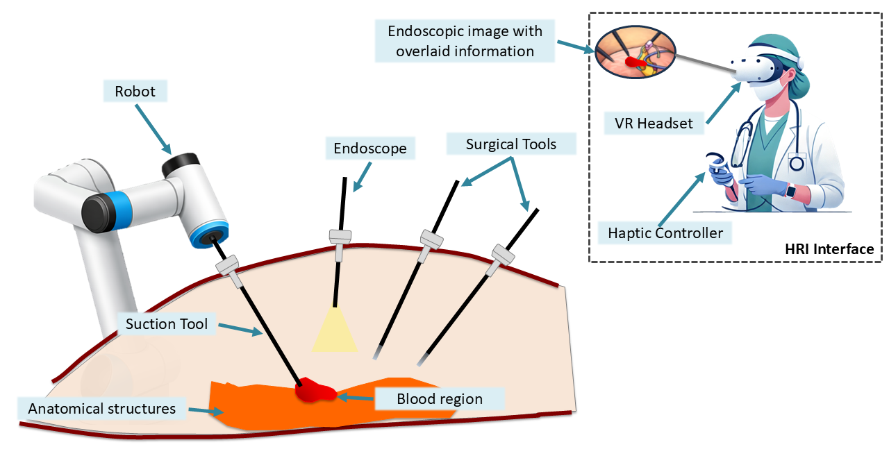
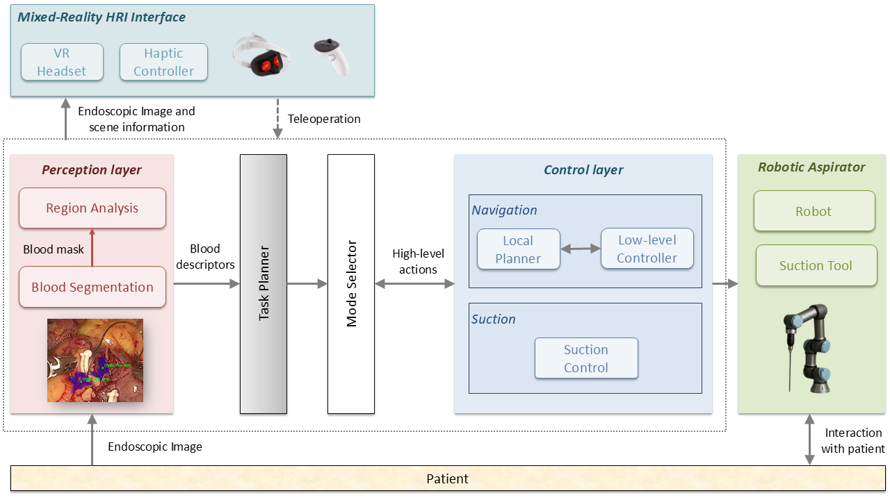
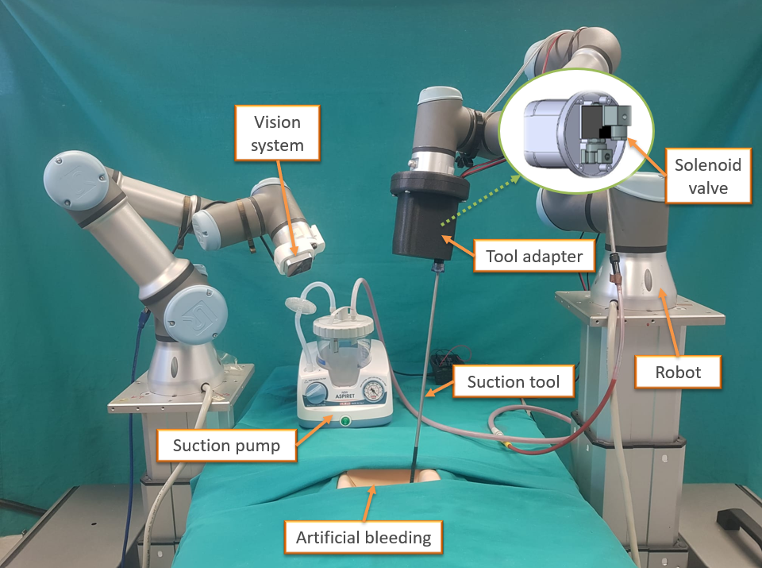
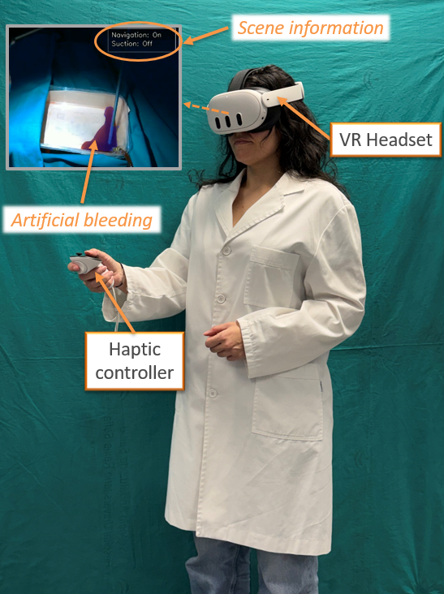

# Design and Implementation of an Autonomous Surgical Robotic

<p align="center">
  <i>E. Góngora-Rodríguez, I. Rivas-Blanco, A. Galán-Cuenca, C. López-Casado, I. García-Morales and V.F. Muñoz</i><br>
</p>

<p align="left">
  
<!--   -->
 <!--   -->
</p>

---

## 🔍 Overview

<p align="center">
  
</p>

<p align="justify">
  This work presents the design and implementation of an autonomous robotic aspirator capable of detecting and removing intraoperative bleeding without continuous human intervention, 
integrating. 
The proposed system integrates a perception module based on a convolutional neural network for real-time blood segmentation, a task planner for high-level actions execution, and a control strategy based on artificial potential fields for autonomous navigation. 
Additionally, a mixed-reality human–robot interaction interface is incorporated to enable system supervision and seamless transition to teleoperation when required.

</p>

<b>Main contributions</b>:
- A unified framework for autonomous surgical blood aspiration integrating perception, task planning, control, and mixed-reality supervision.
- A comparative analysis of four centroid-based target selection strategies for blood aspiration.
- Extensive experimental validation under multiple representative bleeding scenarios

---

## 🧠 Method

<p align="center">
  
</p>

### Pipeline

1. Perception layer for blood segmentation and region analysis (area, centroid and temporal persistence map).
2. Task planner for high-level actions triggering (navigation / suction).
3. Local planner based on Artificial Potenital Fields.
4. Suction control to activate and deactivate the suction tool.
5. Mode selector to switch between autonomous mode and teleoperation.
6. Mixed-Reality HRI interface for system supervision and teleoperation if required. 

---

## 🧠 Experimental setup

<p align="center">
  
  
</p>

- Robotic aspirator using a UR3 robot with a robotic surgical aspirator.
- RGB-D (Intel RealSense D405) as the vision system.
- HRI interface implemented on a Meta Quest 3 system.
- Custom-made artificial bleeding for experimentation. 

---

## 📊 Results and Conclusions

- Fast system response with reaction times below 0.04 s in all scenarios.
- High blood removal performance with 80–94% suctioned area.
- Consistent performance across three representative bleeding scenarios.
- Significant differences between centroid strategies in terms of efficiency and execution time.
- Stable bleeding segmentation in real images with Dice = 0.686 and IoU = 0.565.

---

## 🎬 🎥 Demo

* ▶️ Full experiment: [Add link here]
* ▶️ Failure cases: [Add link here]


---

## 📖 Paper

📄 Under review (link coming soon)

---

## 🌐 Project Page

https://surgicalroboticsuma.github.io/autonomous_aspirator/

---

## 📖 Citation

```bibtex
@article{autonomous_aspirator2025,
  title={Autonomous Surgical Aspirator},
  author={Surgical Robotics UMA},
  journal={Under review},
  year={2025}
}
```

---

## 🙏 Acknowledgements

This research was supported by the Spanish Ministry of Science and Innovation under grant numbers PID2021-125050OA-I00 and PID2022-138206OB-C31.
